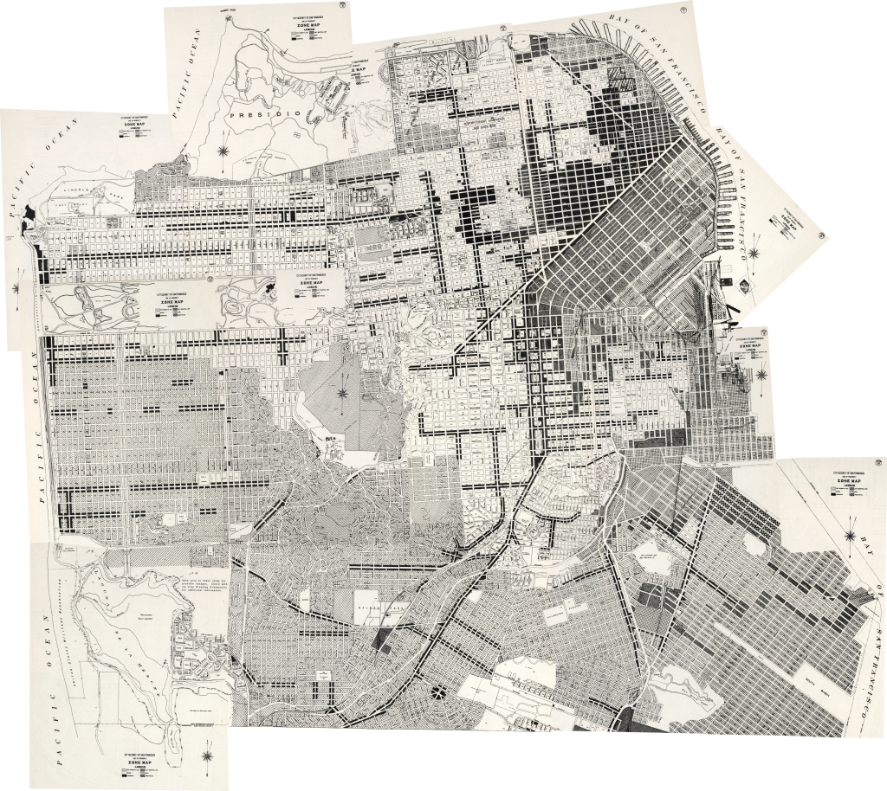

# sf-zoning-maps

Historical San Francisco zoning maps

San Francisco's zoning data has only been digitized back through 1990. The
rest of the maps, dating all the way back to the first planning map in 1921,
only exist on paper in the San Francisco Planning Department archvies. Thanks
to a generous and helpful employee, I was granted access to the archives and
the large format scanner to digitize these maps.

I have uploaded all of these [historical San Francisco zoning maps](https://drive.google.com/drive/folders/10p74RwqmzeQFBrBqjxXdmEOUREx0BLgO?usp=sharing)
to my personal Google drive account. The maps are split across multiple pages
of PDFs, broken out by year.

As far as I know, these pre-processed images should be considered to be in
the public domain, since they are owned by the San Francisco government and
I am making no claims to own the scans I produced. But, if you want to use
them commercially, please reach out to the San Francisco Planning Department
to verify you can legally use them (and then tell me so I can update this
README).

# San Francisco's 1948 zoning map

While this repo is to hold code to automate the georeferencing of these maps,
I did manually georeference the 1948 San Francisco zoning maps:

You can find the [full-size georeferenced TIFF here](https://drive.google.com/file/d/1vSt8paklIS0jysDDiCCsai9hAQxlpYus/view?usp=sharing).
